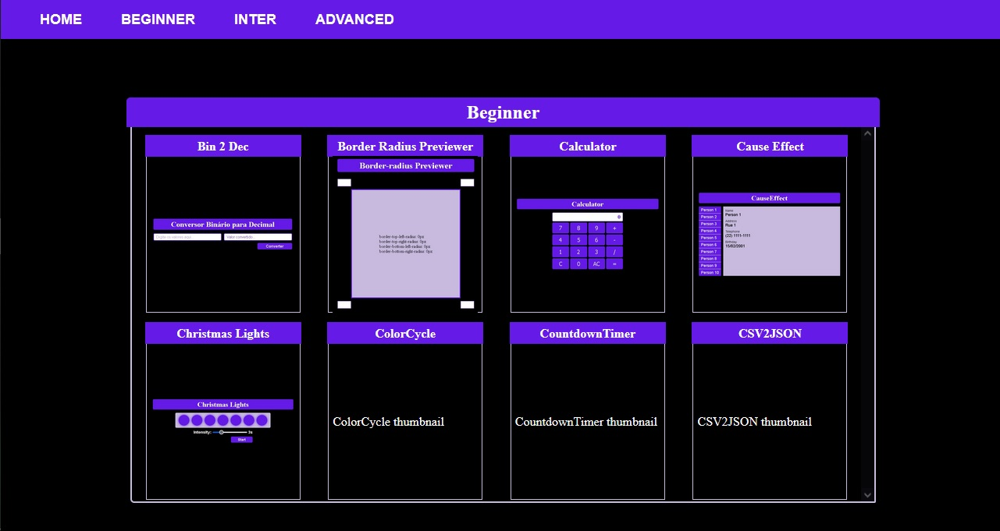
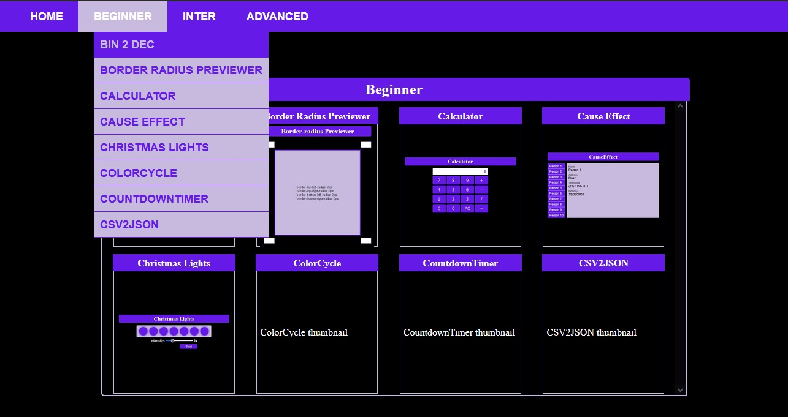
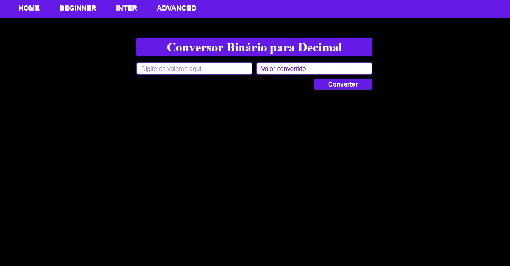

# App-Ideas

Série de exercícios práticos apresentados no [App-Ideas](https://github.com/florinpop17/app-ideas).

## Preview

---

### Home





---

### Bin2Dec



---

## Tecnologias usadas

- [ReactJS v17.0.2](https://reactjs.org)
- [React Router Dom v5.3.0](https://styled-components.com/)
- [Styled Componts](https://styled-components.com/)

---

## Usage

> Instalação

```powershell
yarn || yarn install
```

> Inicia o projeto

```powershell
yarn start
```
